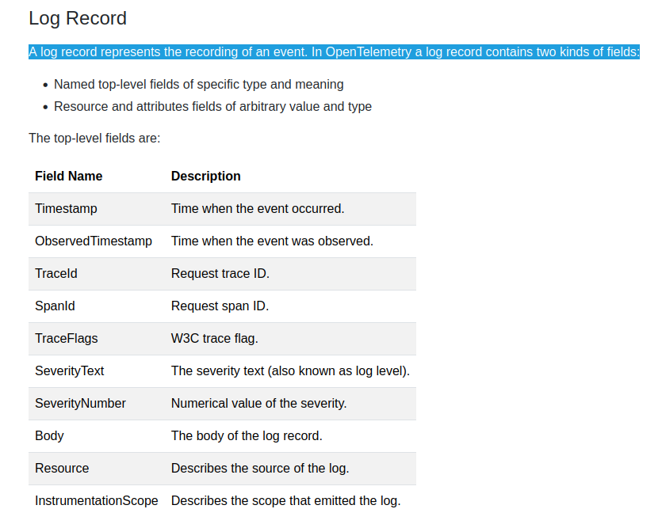

- OpenTelemetry does not define a bespoke API or SDK to create logs. Instead, OpenTelemetry logs are **the existing logs you already have** from a logging framework or infrastructure component. 
- OpenTelemetry’s support for logs is designed to be fully compatible with what you already have, providing capabilities **to wrap those logs with additional context** and a common toolkit to parse and manipulate logs into a common format across many different sources.
- A log record represents the recording of an event. 
- Logs não possuem padrão estrutural, apenas uma ideia de estrutura, através dos atributos top-level: https://github.com/open-telemetry/opentelemetry-specification/blob/v1.48.0/oteps/logs/0097-log-data-model.md#example-log-records 

**These are just examples to help understand the data model. Don’t treat the examples as the way to represent this data model in JSON.**
- 
